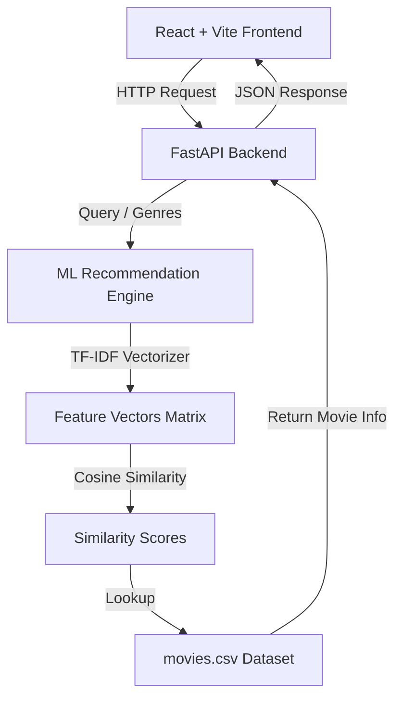

# 🎬 FlixMind — Intelligent Movie Recommendation System

<div align="center">
  
  
  
  
  
  
</div>

---

## 🌟 Project Overview

**FlixMind** is a state-of-the-art, full-stack movie recommendation web application. It empowers users to explore, discover, and search for their next favorite cinematic experience using an intelligent Machine Learning engine.

Our custom-built **Content-Based Filtering Recommendation Engine** runs on mathematical similarity modeling (TF-IDF Vectorization & Cosine Similarity) to analyze genres and plot summaries, returning instantaneous recommendations.

The user interface has been completely redesigned with a **premium futuristic dark glassmorphism theme**, complete with interactive neon floating blur blobs, micro-animations, and styled elements.

---

## ✨ Features

- 🧠 **AI-Powered Recommendation Engine**: Employs Scikit-Learn's TF-IDF Vectorization and Cosine Similarity to calculate exact content overlaps.
- 🔮 **Premium Cinematic Interface**: Modern neon dark theme with dynamic floating background blur blobs, translucent containers, and vibrant gradient typography.
- 🔥 **Live Trending Movie Deck**: Curated list of popular movies with quick-action matching. Click on any trending card to immediately generate similar recommendations.
- 🔍 **Interactive Glowing Search**: A search bar with focused glow effects, custom SVG visual icons, and responsive action states.
- 📊 **Detailed Movie Overview**: Reveals movie posters, synopsis, user-average ratings, and individual genre tag badges.
- ⚡ **High-Speed FastAPI Core**: Backend designed for extremely fast calculations, serving predictions in milliseconds.
- 📱 **Fully Responsive Layout**: Optimizes flawlessly for mobile, tablet, and desktop screens.

---

## 📐 System Architecture



---

## 🧠 Machine Learning Engine Depth

The core recommendation pipeline is built on **Content-Based Filtering**, targeting two primary metadata dimensions: **Genres** and **Plot Overview**.

### 1. Data Cleaning & Feature Combination
We combine the movie's plot overview and its corresponding genre list into a single normalized feature string (or document). 

### 2. TF-IDF (Term Frequency-Inverse Document Frequency)
We feed these documents into Scikit-Learn's `TfidfVectorizer`. TF-IDF measures how important a word is to a document relative to the entire dataset (corpus):
$$\text{TF-IDF}(t, d, D) = \text{TF}(t, d) \times \text{IDF}(t, D)$$
This automatically filters out common stop-words and highlights distinct plot keywords (e.g., "spacecraft", "detective", "magic").

### 3. Cosine Similarity Calculation
Once the numerical document-term matrices are ready, the model computes the cosine of the angle between the two multidimensional feature vectors $A$ and $B$:
$$\text{Similarity}(A, B) = \cos(\theta) = \frac{A \cdot B}{\|A\| \|B\|} = \frac{\sum_{i=1}^{n} A_i B_i}{\sqrt{\sum_{i=1}^{n} A_i^2} \sqrt{\sum_{i=1}^{n} B_i^2}}$$
A value closer to `1` indicates highly overlapping thematic contents. The backend ranks these scores and yields the top matches.

---

## 📡 API Reference

All backend communication happens asynchronously over JSON endpoints.

| Method | Endpoint | Description |
| :--- | :--- | :--- |
| `GET` | `/api/trending` | Returns list of currently trending films based on ratings. |
| `GET` | `/api/recommend?movie_name={query}` | Computes and returns top 10 recommendations + targets details. |
| `GET` | `/api/genres` | Retrieves list of unique genres present in the database. |
| `GET` | `/api/movies?genre={query}` | Returns list of movies filtered by a specified genre. |

---

## 💻 Tech Stack

### Frontend
- **React.js 19** & **Vite** (Next-gen bundling & HMR)
- **Vanilla CSS3** (Custom glassmorphism design system)
- **Google Fonts** (Outfit for headings, Inter for body)
- **Custom SVGs** for interactive states

### Backend
- **FastAPI** (ASGI framework for rapid REST APIs)
- **Uvicorn** (Lightning-fast web server implementation)
- **Scikit-Learn** (TF-IDF & Cosine matrix operations)
- **Pandas** & **NumPy** (Structured dataset querying)

---

## 🚀 Run Locally

### 1. Prerequisite Installations
Ensure you have **Python 3.10+** and **Node.js 18+** installed.

### 2. Clone the Repository
```bash
git clone https://github.com/DarshanH2005/FlixMind.git
cd FlixMind
```

### 3. Backend Setup
```bash
# Navigate to backend folder
cd backend

# Create and activate virtual environment
python -m venv venv
venv\Scripts\activate  # On Windows
source venv/bin/activate  # On macOS/Linux

# Install requirements
pip install -r requirements.txt

# Start FastAPI application
python -m uvicorn main:app --reload --port 8000
```
*Backend server runs on: `http://localhost:8000`*

### 4. Frontend Setup
```bash
# Open a new terminal and navigate to frontend folder
cd frontend

# Install Node dependencies
npm install

# Start Vite server
npm run dev
```
*Frontend interface runs on: `http://localhost:5173`*

---

## 📂 Project Structure

```bash
FlixMind/
├── backend/
│   ├── venv/                 # Python Virtual Environment
│   ├── main.py               # FastAPI Endpoints & CORS Setup
│   ├── ml_engine.py          # TF-IDF Recommender Logic
│   ├── movies.csv            # Recommendation dataset
│   └── requirements.txt      # Backend dependencies
├── frontend/
│   ├── public/               # Public assets
│   ├── src/
│   │   ├── assets/           # Visual resources
│   │   ├── App.jsx           # Main React UI Layout
│   │   ├── App.css           # Local CSS utility classes
│   │   ├── index.css         # Custom Glassmorphism Theme CSS
│   │   └── main.jsx          # React app mounting entry
│   ├── package.json          # Node dependencies & dev scripts
│   └── vite.config.js        # Vite configurations
└── README.md                 # Project Documentation
```

---

## 🤝 Project Management Principles

FlixMind applies modern **Software Project Management (SPM)** concepts to optimize delivery, manage risks, and structure testing.

```text
Requirement Analysis ──► Sprint Estimation ──► Risk Mitigation ──► Unit/System Testing ──► Maintenance
```

### 📋 Requirement Specification & Estimates
We compiled explicit **Functional Requirements** (accurate movie matching, interactive grid filters, trending loads) and **Non-Functional Requirements** (response times $<300$ms, cross-device mobile responsiveness). Tasks were estimated and structured into short development sprints.

### 🛡️ Risk Management Matrix
We actively mapped development risks to guarantee app stability:

| Risk | Impact | Probability | Mitigation Strategy |
| :--- | :--- | :--- | :--- |
| **Dataset Inconsistencies** | High | Low | Robust preprocessing of missing overview / genre fields in Pandas. |
| **API Endpoint Failures** | Critical | Low | Comprehensive `HTTPException` error wrapping on FastAPI routes. |
| **Heavy Computational Lag** | High | Medium | Pre-calculation of vector mappings and TF-IDF fit matrices on server startup. |

### 🧪 Multi-Level Testing
- **Unit Testing**: Evaluated backend ML similarity scoring modules.
- **Integration Testing**: Confirmed accurate JSON handshakes between React endpoints and Uvicorn.
- **User Acceptance (UAT)**: Validated readability, animations, and intuitive back-navigation.

---

## 📜 License & Credit

Distributed under the **MIT License**. Created by [DarshanH2005](https://github.com/DarshanH2005).

⭐ *If you find FlixMind helpful, please star this repository!*
